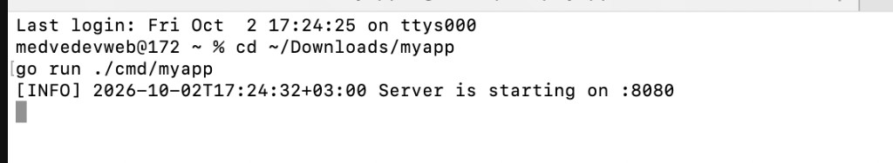
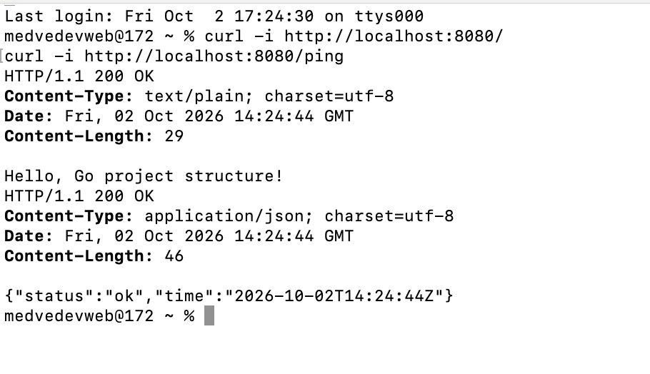

# myapp (PZ2)

Учебный проект по структуре Go-приложения: входная точка в `cmd/`, приватная логика в `internal/`, вспомогательный логгер в `utils/`.

## Запуск

```bash
go run ./cmd/myapp
```

Проверка:

```bash
curl -i http://localhost:8080/
curl -i http://localhost:8080/ping
```

Сборка:

```bash
go build -o bin/myapp ./cmd/myapp
./bin/myapp
```

## Структура

```text
myapp/
├─ cmd/myapp/main.go
├─ internal/app/app.go
├─ utils/logger.go
├─ docs/
│  ├─ server-run.png
│  └─ curl-check.png
├─ go.mod
└─ README.md
```

## Маршруты

| Путь   | Ответ                                      |
|--------|--------------------------------------------|
| `/`    | текст `Hello, Go project structure!`       |
| `/ping`| JSON `{ "status":"ok", "time":"<RFC3339>" }` |

## Скриншоты проверки

### Запуск сервера



### Ответы `/` и `/ping`



## Куда класть артефакты (мини-эссе)

1. **OpenAPI/Swagger-схему** — в `api/`: это контракт внешнего API, его удобно хранить отдельно от хендлеров, чтобы фронт и клиенты могли читать спецификацию без импорта Go-кода.
2. **Dockerfile и CI-скрипты сборки** — в `build/`: описание упаковки и пайплайна не относится к бизнес-логике и не должно смешиваться с `internal/`.
3. **docker-compose / Helm / Terraform** — в `deployments/`: шаблоны окружений для запуска сервиса, а не код приложения.
4. **Примеры конфигов** (порт, таймауты) — в `configs/`: дефолты и образцы настроек для локального и продового запуска.
5. **Скрипты локальных задач** (линт, генерация, smoke-check) — в `scripts/`: чтобы Makefile оставался тонким, а рутина жила отдельными утилитами.

Для маленького учебного сервиса достаточно `cmd/` + `internal/` + `utils/`; `pkg/` пока не нужен, потому что публичных библиотек наружу мы не отдаём. `src/` в корне не используем: в модульных проектах это путает с устаревшим layout `$GOPATH/src`.
